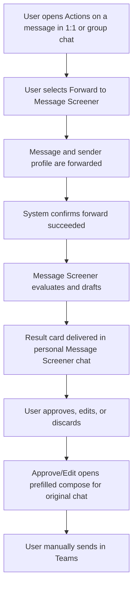

# Message Action Forwarding V1 Requirements

## Problem Frame
The previous direction depended on background Graph ingestion for automatic DM screening, which is blocked in user-only tenant contexts without admin consent. The product needs a non-admin path that still makes screening useful in daily Teams workflows.

V1 pivots to user-invoked screening from the Teams message Actions menu in 1:1 and group chats: the user explicitly forwards a selected message (with sender context) to Message Screener, then reviews output in personal chat.

## Requirements

**Invocation and Forwarding**
- R1. The app MUST appear in the Actions menu for messages in 1:1 and group chats so the user can invoke screening from message context.
- R1a. V1 MUST target desktop, web, and mobile Teams clients; if a client surface cannot expose the action, the user MUST be routed to the defined fallback flow.
- R2. The forwarding action MUST be explicitly user-initiated and MUST NOT rely on background monitoring of inbound chats.
- R3. The forwarding interaction MUST use a minimal-interaction path appropriate to the client surface and then show a user-visible confirmation.
- R4. The forwarding flow MUST process full sender profile context available from Teams message-action payloads for screening quality.
- R4a. The system MUST persist only sender display name and a best-available sender identity key; additional sender profile fields are transient-only and MUST NOT be persisted.
- R4aa. Sender identity key hierarchy MUST be: AAD object ID when available, else Teams sender ID, else unresolved sender-key state.
- R4ab. If sender-key state is unresolved, screening MUST still proceed, and records MUST be explicitly marked as unresolved-identity in audit and telemetry.
- R4b. Duplicate forwards for the same source message MUST be idempotent for 24 hours: the system returns the existing screening result rather than creating a new processing run.
- R4c. If a duplicate forward arrives while the original run is in-flight, the user MUST see current pending status tied to the existing run; if the original run failed, the user MUST be offered one-click requeue.

**Screening and Output Experience**
- R5. Screening results MUST be delivered to the user in Message Screener personal chat only.
- R6. Result cards MUST include actions for Approve, Edit, and Discard.
- R6a. Approve and Edit SHOULD open a prefilled compose draft targeting the original conversation context when supported by the client surface; otherwise, the system MUST provide copy-ready response text and explicit paste guidance.
- R7. The no-auto-send rule remains absolute: no response is sent unless the user manually confirms send in Teams.
- R8. If message-action forwarding is unavailable (for example app not installed or unsupported client surface), the system MUST provide guided fallback that opens personal screener chat with a prefilled forward template.
- R8a. Failed forwarding attempts MUST show recoverable guidance that tells the user how to retry.
- R8b. The fallback prefilled template MUST include source message text and sender display name.
- R8c. If source message context cannot be captured on an unsupported client surface, fallback MUST open personal screener chat with manual-paste template and clear guidance.

**Security, Privacy, and Audit**
- R9. The system MUST record an audit event for each forward action with timestamp, source chat context, and immutable event ID.
- R10. Sender profile data captured from message actions MUST be handled under least-retention principles and redaction policy in logs and displays.
- R11. Access to forwarded-content history and screening results in personal-agent mode MUST be restricted to the owning user.

## Success Criteria
- p95 user time from opening message Actions to forward confirmation is under 5 seconds on supported clients.
- At least 95% of action invocations are accepted by the forwarding endpoint.
- At least 95% of accepted forwards produce a result card in personal screener chat within 15 seconds.
- 0 auto-send violations in test and pilot environments.
- At least 90% of failed forwards provide an actionable retry path users can complete without admin help.
- At least 90% of fallback-triggered attempts provide a successful path (context-forward or manual-paste flow) without admin help.

## Scope Boundaries
- V1 excludes background or automatic screening of all incoming DMs.
- V1 excludes tenant-admin-dependent Graph subscription flows as a required intake path.
- V1 excludes channel-message intake.
- V1 excludes routing results back into the originating private chat.

## Key Decisions
- Action-invoked intake is the v1 primary path: chosen to remove tenant-admin dependency while preserving core screening value.
- Forwarding processes full sender profile context transiently while persisting only display name plus best-available sender identity key: chosen to balance screening quality with privacy-minimizing retention across internal and external senders.
- V1 scope includes 1:1 and group chats (not channels): chosen for practical coverage without channel-scale noise.
- V1 includes desktop, web, and mobile clients with explicit fallback when action surfaces are unavailable: chosen to maintain a consistent user promise.
- Result delivery stays in personal screener chat: chosen for privacy, queue clarity, and reduced accidental leakage risk.

## Dependencies / Assumptions
- Teams platform capabilities support surfacing the app in private-message Actions for the target client surfaces.
- The current bot/personal chat channel remains available for result-card delivery.

## Outstanding Questions

### Resolve Before Planning
- [Affects R6a][Product/Technical] Confirm compose-targeting contract across desktop/web/mobile and define per-client fallback behavior where compose-targeting is unsupported.
- [Affects R4a, R4aa, R4ab][Product/Technical] Confirm unresolved sender-key handling policy, including dedupe, audit labeling, and telemetry treatment.

### Deferred to Planning
- [Affects R1, R1a][Technical] Exact Teams capability configuration and compatibility test matrix for action-surface behavior by client.
- [Affects R4a, R4aa, R4ab, R10][Technical] Storage and redaction implementation details for sender identity key and unresolved-identity records in audit and operational telemetry.

## Next Steps
Next: run /ce-plan for structured implementation planning.
