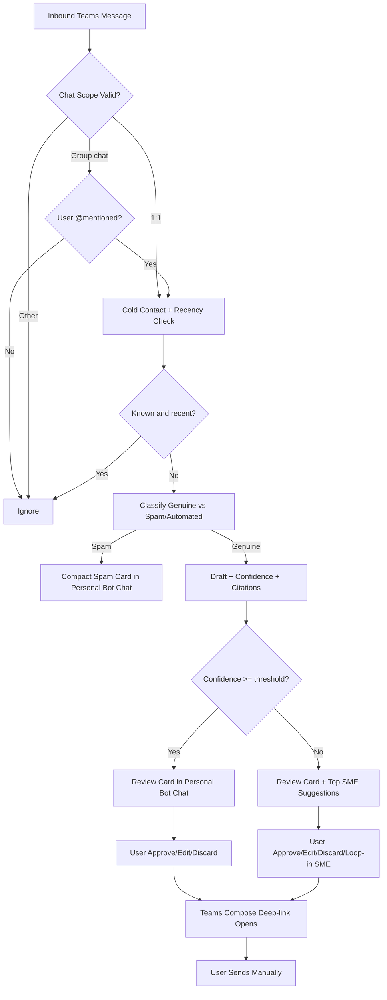

# Teams Integration V1 Requirements

## Problem Frame

The project has a strong Teams-first product direction, but implementation-level product behavior for actual Teams integration is not yet pinned down in one place. Without a dedicated requirements artifact, planning would have to invent trigger conditions, chat scope behavior, review delivery model, and operational constraints.

This brainstorm defines the v1 Teams integration behavior for a personal agent that drafts responses and routes low-confidence items safely, while preserving no-auto-send guarantees and preparing cleanly for v2 email expansion.

## Requirements

**Scope and Triggers**
- R1. The agent MUST monitor Teams 1:1 chats and group chats in v1.
- R2. In group chats, the agent MUST trigger only when the user is explicitly @mentioned.
- R3. The agent MUST ignore channel messages in v1.
- R4. Before drafting, the agent MUST evaluate cold-contact status using a deterministic recency rule based on prior direct interactions with the sender identity.
- R5. The recency window MUST be user-configurable without code changes (default: 6 months), and the effective value MUST be visible in settings and recorded in audit events.
- R5a. Trigger events in v1 are limited to newly created user-authored text messages; edits, deletions, reactions, system events, and bot-authored messages MUST be ignored.
- R5b. Attachment-only messages MUST NOT trigger drafting in v1.
- R5c. The agent MUST ignore messages authored by the user to prevent self-trigger loops.
- R5d. Event handling MUST be idempotent: duplicate create deliveries for the same message MUST NOT create duplicate review cards, duplicate draft intents, or duplicate audit actions.

Recency decision for v1:
- A sender is known and recent when the sender identity has at least one direct interaction with the user in Teams (1:1 or group) within the configured window.

**Decisioning and Drafting**
- R6. The agent MUST classify triggered messages as Genuine or Likely Spam/Automated before drafting.
- R6a. v1 classification policy MUST optimize for minimizing false-spam outcomes; domain-level reclassification learning is allowed, but per-user classifier tuning is out of scope for v1.
- R7. Genuine messages MUST produce a draft response with confidence score and citation markers that reference only sources used for generation; if no supporting source exists, the card MUST display `No supporting source retrieved`.
- R8. Low-confidence cases MUST include up to 3 SME suggestions with one-line rationale.
- R9. Spam cases MUST generate a compact review card with Discard and Reclassify actions.
- R10. The no-auto-send rule is absolute: no response is sent unless the user manually sends from Teams compose.

**Review Experience (Teams)**
- R11. Review Adaptive Cards MUST be delivered to the user's personal bot chat, not inline in originating chats.
- R11a. If personal bot chat delivery is unavailable (for example app not installed or permission failure), the agent MUST surface a recoverable fallback notification in Teams with re-activation guidance and MUST log the delivery failure reason.
- R12. Genuine/low-confidence review cards MUST expose Approve, Edit, and Discard actions.
- R13. Low-confidence review cards MUST expose a Loop-in SME action that only prepares compose-ready draft content and MUST NOT send messages or create chats automatically.
- R14. Approve MUST open a Teams compose deep-link with pre-populated content.
- R15. Edit MUST open Teams compose deep-link for user modification before send.
- R15a. If deep-link payload limits are exceeded, the system MUST fall back to a shortened compose draft plus a link to full draft context in personal bot chat.

**Operational and Security Constraints**
- R16. The implementation MUST target .NET 10 and follow managed identity-first authentication.
- R17. The runtime model for v1 MUST assume Azure Container Apps always-on hosting.
- R18. Telemetry MUST be OpenTelemetry-first (traces, metrics, logs), including structured security and decision events.
- R19. The system MUST maintain append-only, user-accessible audit history for key decision and action events, with immutable event IDs and event timestamps.
- R19a. Audit retention in v1 MUST default to 90 days and be tenant-configurable.
- R19b. Audit views in v1 personal-agent mode MUST be restricted to the owning user.
- R19c. Sensitive fields in audit payloads MUST be redacted by policy before storage and display.
- R20. Prompt-injection and sensitive-content controls MUST run before draft display; if controls fail, the system MUST suppress draft content, show a safe-review message, and log the guard reason.

## Success Criteria
- For 95% of triggered messages, a review card is delivered to personal bot chat within 10 seconds; for 99%, within 30 seconds (from message create event receipt to card post success).
- Users can move from review card to compose-ready draft in under 30 seconds for common cases.
- 0 auto-send violations in pilot and test environments.
- At least 80% of low-confidence cases with explicit user feedback (accept/thumbs-up on suggested SME) are rated relevant over a rolling 30-day window, with minimum sample size of 50 events.
- End-to-end decision traceability is available for every processed message.

## Scope Boundaries
- v1 excludes Outlook intake and email draft handling.
- v1 excludes Teams channel monitoring.
- v1 is single-user personal-agent behavior, not shared-team inbox behavior.
- v1 does not attempt autonomous sending under any condition.

## Key Decisions
- Teams scope includes 1:1 plus group chat: chosen to increase coverage without jumping to channels.
- Group trigger uses explicit @mention: chosen to reduce noise and accidental over-triggering.
- Review cards go to personal bot chat: chosen for cleaner review queue and clearer audit trace.
- Hosting baseline is Azure Container Apps always-on: chosen for warm, predictable webhook and processing behavior.

## Dependencies / Assumptions
- Teams app/bot is installed in personal scope and has permission to send proactive cards.
- Graph change-notification subscriptions for Teams resources are available in tenant.
- Tenant policy permits required scopes for Teams read/notify workflow.

## Outstanding Questions

### Resolve Before Planning
- None. Product decisions required for planning are resolved in this document.

### Deferred to Planning
- [Affects R4, R5][Technical] Exact algorithm and storage strategy for recency check in group-chat contexts.
- [Affects R6, R7, R8][Technical] Confidence calibration method and threshold segmentation by scenario.
- [Affects R11-R15][Technical] Deep-link payload boundaries and fallback behavior for long drafts.
- [Affects R18, R19][Needs research] Optimal audit-log backend and tamper-evidence mechanism in tenant-bound storage.

## Next Steps
→ /ce-plan for structured implementation planning.
